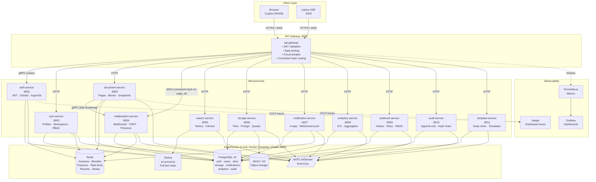
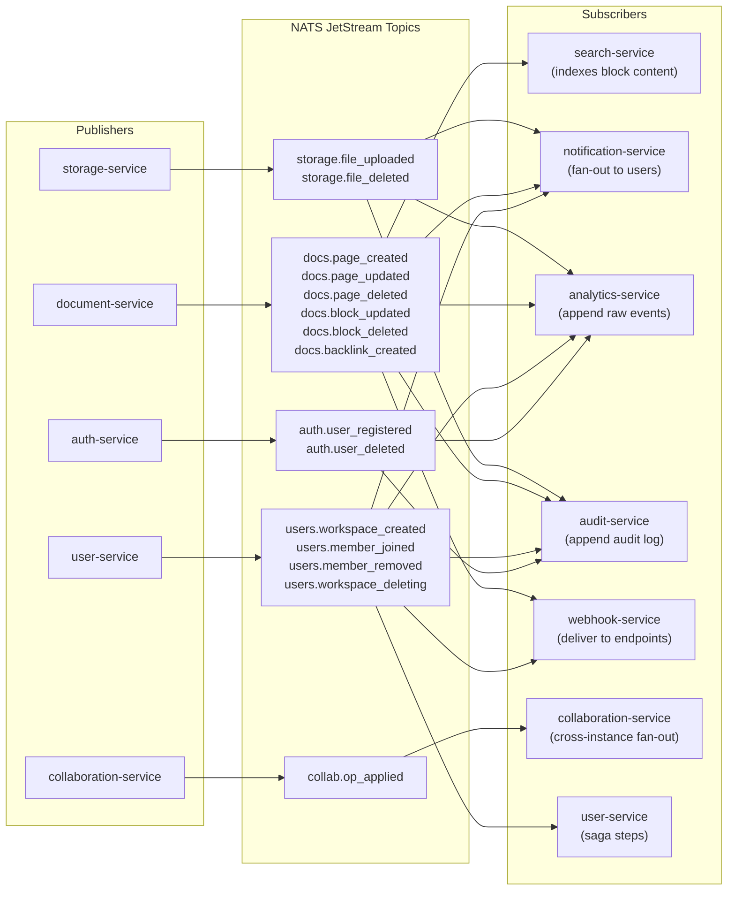
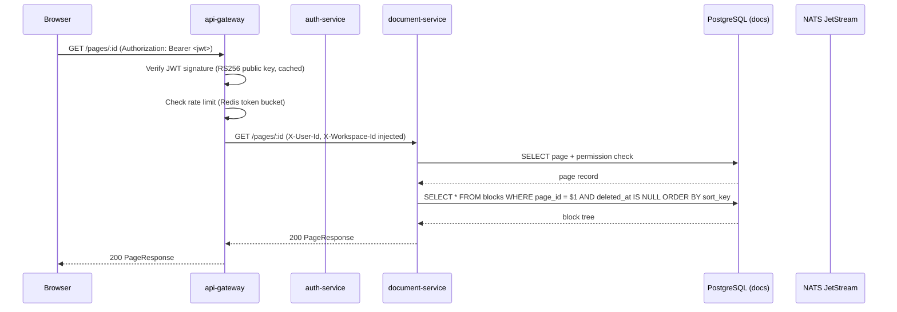
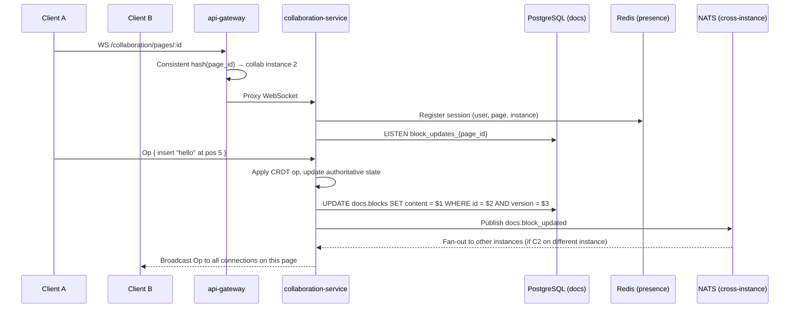

# BitTree — System Architecture

---

## 1. High-Level Service Map



---

## 2. NATS Event Bus — Who Publishes & Who Subscribes

> Every service that mutates state publishes domain events to NATS JetStream.
> Downstream services subscribe and react without coupling to the publisher.



---

## 3. Request Flow — Authenticated REST Call



---

## 4. Request Flow — Real-Time Collaboration (WebSocket)



---

## 5. Clean Architecture Layers (per service)

```
┌─────────────────────────────────────────────┐
│  Presentation (axum handlers, extractors)    │  ← HTTP in, HTTP out
│  - Routes, State, Request/Response types     │
├─────────────────────────────────────────────┤
│  Domain (pure Rust — zero external deps)     │  ← Business logic lives here
│  - Entities: Page, Block, User, Workspace    │
│  - Repository traits: PageRepo, BlockRepo    │
│  - Domain errors: thiserror enums            │
│  - Use cases / service structs               │
├─────────────────────────────────────────────┤
│  Infrastructure (implements domain traits)   │  ← Swappable
│  - PostgresPageRepo (impl PageRepo)          │
│  - RedisCache       (impl CacheStore)        │
│  - NatsPublisher    (impl EventPublisher)    │
│  - MinioStore       (impl ObjectStore)       │
└─────────────────────────────────────────────┘
         ↑ dependency arrows point inward only
         Domain never imports Infrastructure
```

**Dependency rule:** Infrastructure depends on Domain. Domain depends on nothing outside `std` and `libs/shared`. This is what makes swapping PostgreSQL (or Redis → DragonflyDB) a single-layer change.

---

## 6. Local Dev Stack (Docker Compose)

| Container | Image | Port | Used by |
|---|---|---|---|
| `postgres` | `postgres:16-alpine` | 5432 | all services |
| `redis` | `redis:7-alpine` | 6379 | auth, user, doc, collab, notif |
| `nats` | `nats:2-alpine` (JetStream) | 4222 | all services |
| `minio` | `minio/minio` | 9000 / 9001 (console) | storage |
| `jaeger` | `jaegertracing/all-in-one` | 16686 (UI) / 4317 (OTLP) | all services |
| `prometheus` | `prom/prometheus` | 9090 | scrapes `:service_port/metrics` |
| `grafana` | `grafana/grafana` | 3001 | dashboard UI |

---

## 7. Cloud Deployment (AWS)

```
Internet
    │
    ▼
┌─────────────────────────────────────────────────────────┐
│                        AWS VPC                           │
│                                                          │
│  Route 53 ──▶ CloudFront ──▶ ALB                        │
│                               │                          │
│              ┌────────────────▼────────────────┐        │
│              │       ECS / EKS Cluster          │        │
│              │                                  │        │
│              │  api-gateway  (public subnet)    │        │
│              │       │                          │        │
│              │  ┌────┴─────────────────────┐    │        │
│              │  │  Services (private subnet) │   │        │
│              │  │  auth · user · doc        │   │        │
│              │  │  collab · search · storage │  │        │
│              │  │  notif · analytics · etc  │   │        │
│              │  └────────────┬──────────────┘   │        │
│              └───────────────┼──────────────────┘        │
│                              │                           │
│         ┌────────────────────▼──────────────────┐       │
│         │           Managed Services              │       │
│         │  RDS PostgreSQL                        │       │
│         │  ElastiCache (Redis)                   │       │
│         │  Amazon MQ / managed NATS              │       │
│         │  S3 (object storage)                   │       │
│         │  CloudWatch / X-Ray (observability)    │       │
│         │  Secrets Manager (JWT keys, DB URLs)   │       │
│         └────────────────────────────────────────┘       │
└─────────────────────────────────────────────────────────┘
```

IaC: `infra/` directory — Pulumi Rust SDK provisions all resources above.

---

## 8. gRPC Transport — Service Pairs

The default inter-service transport is HTTP (Axum) for synchronous calls and NATS JetStream for async events. gRPC (tonic + prost) is used only for the three pairs below, each with a concrete technical justification.

| Service Pair | RPC Type | Proto file | Reason |
|---|---|---|---|
| `api-gateway` → `auth-service` | Unary RPC | `libs/proto/proto/auth.proto` | JWT validation on every request — high frequency; binary protobuf + HTTP/2 multiplexing reduces per-call overhead |
| `document-service` → `collaboration-service` | Bidirectional streaming RPC | `libs/proto/proto/collab.proto` | Continuous op delivery in both directions for the lifetime of a live editing session |
| `analytics-service` internal ETL batch ingestion | Client-streaming RPC | `libs/proto/proto/analytics.proto` | Stream large event batches with gRPC flow control; no per-record round-trip overhead |

All `.proto` definitions and `prost`/`tonic-build` codegen live in the `libs/proto` crate. Services that do not participate in any of these three pairs are unaffected and do not depend on `libs/proto`.

See [`docs/architecture/adr/ADR-003-grpc-selective-transport.md`](adr/ADR-003-grpc-selective-transport.md) for the full decision record.
