# BitTree — Data Model (SurrealDB)

> **Database:** SurrealDB 2.x (multi-model: document + graph + relational)
> **Query Language:** SurrealQL
> **Rust SDK:** `surrealdb` crate

---

## Namespace / Database Layout

```
Namespace: bittree
├── Database: auth          (auth-service)
├── Database: users         (user-service)
├── Database: docs          (document-service, collaboration-service, template-service)
├── Database: storage       (storage-service)
├── Database: notifications (notification-service)
├── Database: analytics     (analytics-service)
└── Database: audit         (audit-service)
```

Collaboration-service uses SurrealDB `LIVE SELECT` on the `docs` database plus Redis for ephemeral presence state. Search-service maintains a Tantivy index fed by SurrealDB change events.

---

## Entity Relationship Diagram

> Solid lines = stored relationship (record link or graph edge).
> Dashed lines = cross-database reference (not DB-enforced; resolved at application layer).
> `[EDGE]` = SurrealDB graph edge (`RELATE a->edge->b`); attributes live on the edge record.

```mermaid
erDiagram

    %% ── auth database ──────────────────────────────────────────
    CREDENTIAL {
        record   user_id
        string   provider
        string   provider_user_id
        string   password_hash
        datetime created_at
    }

    REFRESH_TOKEN {
        record   user_id
        string   family_id
        string   token_hash
        bool     revoked
        datetime expires_at
        datetime created_at
    }

    %% ── users database ──────────────────────────────────────────
    USER {
        string   email
        string   display_name
        string   avatar_url
        bool     email_verified
        datetime created_at
        datetime updated_at
        datetime deleted_at
    }

    WORKSPACE {
        string   slug
        string   name
        string   icon
        string   plan
        datetime created_at
        datetime updated_at
        datetime deleted_at
    }

    MEMBER_OF_EDGE {
        string   role
        datetime joined_at
    }

    WORKSPACE_INVITE {
        record   workspace_id
        record   invited_by
        string   email
        string   token_hash
        string   role
        bool     accepted
        datetime expires_at
        datetime created_at
    }

    USER_FAVORITE_EDGE {
        datetime created_at
    }

    %% ── docs database ───────────────────────────────────────────
    PAGE {
        record   workspace_id
        record   created_by
        record   last_edited_by
        string   title
        string   icon
        string   cover_url
        bool     is_database
        string   visibility
        bool     locked
        int      version
        datetime created_at
        datetime updated_at
        datetime deleted_at
    }

    PAGE_PERMISSION {
        record   page_id
        record   user_id
        string   role
        record   granted_by
        datetime granted_at
    }

    PAGE_GUEST {
        record   page_id
        string   email
        string   token_hash
        bool     revoked
        datetime expires_at
        datetime created_at
    }

    BLOCK {
        record   page_id
        record   created_by
        record   last_edited_by
        string   block_type
        object   content
        object   properties
        int      version
        datetime created_at
        datetime updated_at
        datetime deleted_at
    }

    CHILD_PAGE_EDGE {
        string   sort_key
    }

    CONTAINS_EDGE {
        string   sort_key
    }

    CHILD_OF_EDGE {
        string   sort_key
    }

    REFERENCES_EDGE {
        datetime created_at
    }

    DB_RELATION_EDGE {
        string   property_id
        datetime created_at
    }

    PAGE_SNAPSHOT {
        record   page_id
        record   created_by
        object   snapshot
        datetime created_at
    }

    %% ── storage database ────────────────────────────────────────
    FILE {
        record   workspace_id
        record   uploaded_by
        string   storage_key
        string   original_name
        string   mime_type
        int      size_bytes
        string   checksum
        datetime created_at
        datetime deleted_at
    }

    %% ── notifications database ──────────────────────────────────
    NOTIFICATION {
        record   user_id
        string   notification_type
        object   payload
        bool     read
        datetime created_at
        datetime read_at
    }

    %% ── analytics database ──────────────────────────────────────
    ANALYTICS_EVENT {
        record   workspace_id
        record   user_id
        string   event_type
        object   properties
        datetime occurred_at
    }

    %% ── audit database ──────────────────────────────────────────
    AUDIT_EVENT {
        record   workspace_id
        record   actor_id
        string   event_type
        object   payload
        string   prev_hash
        datetime occurred_at
    }

    %% ── auth relationships ──────────────────────────────────────
    USER ||--o{ CREDENTIAL         : "authenticated via"
    USER ||--o{ REFRESH_TOKEN      : "owns"

    %% ── users relationships ─────────────────────────────────────
    USER         ||--o{ MEMBER_OF_EDGE    : "in"
    WORKSPACE    ||--o{ MEMBER_OF_EDGE    : "has members"
    USER         ||--o{ WORKSPACE_INVITE  : "sends"
    WORKSPACE    ||--o{ WORKSPACE_INVITE  : "receives"
    USER         ||--o{ USER_FAVORITE_EDGE : "stars"
    PAGE         ||--o{ USER_FAVORITE_EDGE : "starred by"

    %% ── docs relationships ──────────────────────────────────────
    WORKSPACE    ||--o{ PAGE              : "owns"
    PAGE         ||--o{ CHILD_PAGE_EDGE   : "parent of"
    PAGE         ||--o{ CHILD_PAGE_EDGE   : "child of"
    PAGE         ||--o{ CONTAINS_EDGE     : "contains"
    BLOCK        ||--o{ CONTAINS_EDGE     : "contained in"
    BLOCK        ||--o{ CHILD_OF_EDGE     : "parent block"
    BLOCK        ||--o{ CHILD_OF_EDGE     : "child block"
    BLOCK        ||--o{ REFERENCES_EDGE   : "references"
    PAGE         ||--o{ REFERENCES_EDGE   : "referenced by"
    BLOCK        ||--o{ DB_RELATION_EDGE  : "relates to"
    PAGE         ||--o{ PAGE_PERMISSION   : "has overrides"
    USER         ||--o{ PAGE_PERMISSION   : "granted on"
    PAGE         ||--o{ PAGE_GUEST        : "guest access"
    PAGE         ||--o{ PAGE_SNAPSHOT     : "snapshots"

    %% ── cross-database (application-resolved) ───────────────────
    USER         ||--o{ NOTIFICATION      : "receives"
    WORKSPACE    ||--o{ ANALYTICS_EVENT   : "generates"
    WORKSPACE    ||--o{ FILE              : "stores"
    USER         ||--o{ FILE              : "uploads"
    WORKSPACE    ||--o{ AUDIT_EVENT       : "audited in"
```



---

## Entity Definitions

### `auth` Database

```surql
-- Users' authentication credentials
DEFINE TABLE credential SCHEMAFULL;
DEFINE FIELD user_id          ON credential TYPE record<user>;
DEFINE FIELD provider         ON credential TYPE string
    ASSERT $value IN ["local", "github", "google"];
DEFINE FIELD provider_user_id ON credential TYPE option<string>;
DEFINE FIELD password_hash    ON credential TYPE option<string>;
DEFINE FIELD created_at       ON credential TYPE datetime DEFAULT time::now();

-- Refresh tokens (stored hashed, rotated on use)
DEFINE TABLE refresh_token SCHEMAFULL;
DEFINE FIELD user_id    ON refresh_token TYPE record<user>;
DEFINE FIELD family_id  ON refresh_token TYPE string;
DEFINE FIELD token_hash ON refresh_token TYPE string;
DEFINE FIELD revoked    ON refresh_token TYPE bool DEFAULT false;
DEFINE FIELD expires_at ON refresh_token TYPE datetime;
DEFINE FIELD created_at ON refresh_token TYPE datetime DEFAULT time::now();
DEFINE INDEX idx_token_hash ON refresh_token FIELDS token_hash UNIQUE;
```

### `users` Database

```surql
DEFINE TABLE user SCHEMAFULL;
DEFINE FIELD email          ON user TYPE string ASSERT string::is::email($value);
DEFINE FIELD display_name   ON user TYPE string;
DEFINE FIELD avatar_url     ON user TYPE option<string>;
DEFINE FIELD email_verified ON user TYPE bool DEFAULT false;
DEFINE FIELD created_at     ON user TYPE datetime DEFAULT time::now();
DEFINE FIELD updated_at     ON user TYPE datetime DEFAULT time::now();
DEFINE FIELD deleted_at     ON user TYPE option<datetime>;
DEFINE INDEX idx_email      ON user FIELDS email UNIQUE;

DEFINE TABLE workspace SCHEMAFULL;
DEFINE FIELD slug       ON workspace TYPE string;
DEFINE FIELD name       ON workspace TYPE string;
DEFINE FIELD icon       ON workspace TYPE option<string>;
DEFINE FIELD plan       ON workspace TYPE string DEFAULT "free"
    ASSERT $value IN ["free", "pro", "team", "enterprise"];
DEFINE FIELD created_at ON workspace TYPE datetime DEFAULT time::now();
DEFINE FIELD updated_at ON workspace TYPE datetime DEFAULT time::now();
DEFINE FIELD deleted_at ON workspace TYPE option<datetime>;
DEFINE INDEX idx_slug   ON workspace FIELDS slug UNIQUE;

-- Graph edge: user --member_of--> workspace
DEFINE TABLE member_of SCHEMALESS;
DEFINE FIELD role      ON member_of TYPE string
    ASSERT $value IN ["owner", "admin", "editor", "commenter", "viewer"];
DEFINE FIELD joined_at ON member_of TYPE datetime DEFAULT time::now();
-- RELATE user:uuid->member_of->workspace:uuid SET role = "editor";
-- SELECT ->member_of->workspace FROM user:uuid;
-- SELECT <-member_of<-user, member_of.role FROM workspace:uuid;

DEFINE TABLE workspace_invite SCHEMAFULL;
DEFINE FIELD workspace  ON workspace_invite TYPE record<workspace>;
DEFINE FIELD invited_by ON workspace_invite TYPE record<user>;
DEFINE FIELD email      ON workspace_invite TYPE string;
DEFINE FIELD token_hash ON workspace_invite TYPE string;
DEFINE FIELD role       ON workspace_invite TYPE string;
DEFINE FIELD accepted   ON workspace_invite TYPE bool DEFAULT false;
DEFINE FIELD expires_at ON workspace_invite TYPE datetime;
DEFINE FIELD created_at ON workspace_invite TYPE datetime DEFAULT time::now();
DEFINE INDEX idx_token  ON workspace_invite FIELDS token_hash UNIQUE;

-- Graph edge: user --favorites--> page  (cross-DB reference stored as string ID)
DEFINE TABLE favorites SCHEMALESS;
DEFINE FIELD created_at ON favorites TYPE datetime DEFAULT time::now();
-- RELATE user:uuid->favorites->page:uuid;
-- SELECT ->favorites->page FROM user:uuid;
```

### `docs` Database

```surql
DEFINE TABLE page SCHEMAFULL;
DEFINE FIELD workspace      ON page TYPE record<workspace>;
DEFINE FIELD created_by     ON page TYPE record<user>;
DEFINE FIELD last_edited_by ON page TYPE record<user>;
DEFINE FIELD title          ON page TYPE string;
DEFINE FIELD icon           ON page TYPE option<string>;
DEFINE FIELD cover_url      ON page TYPE option<string>;
DEFINE FIELD is_database    ON page TYPE bool DEFAULT false;
DEFINE FIELD visibility     ON page TYPE string DEFAULT "workspace"
    ASSERT $value IN ["private", "workspace", "custom", "public"];
DEFINE FIELD locked         ON page TYPE bool DEFAULT false;
DEFINE FIELD locked_by      ON page TYPE option<record<user>>;
DEFINE FIELD version        ON page TYPE int DEFAULT 0;
DEFINE FIELD published_slug ON page TYPE option<string>;
DEFINE FIELD created_at     ON page TYPE datetime DEFAULT time::now();
DEFINE FIELD updated_at     ON page TYPE datetime DEFAULT time::now();
DEFINE FIELD deleted_at     ON page TYPE option<datetime>;
DEFINE INDEX idx_slug       ON page FIELDS published_slug UNIQUE;

-- Graph edge: page --child_page--> page  (page hierarchy)
DEFINE TABLE child_page SCHEMALESS;
DEFINE FIELD sort_key ON child_page TYPE string;

-- Per-page permission overrides (only present when visibility = "custom")
DEFINE TABLE page_permission SCHEMAFULL;
DEFINE FIELD page       ON page_permission TYPE record<page>;
DEFINE FIELD user_id    ON page_permission TYPE record<user>;
DEFINE FIELD role       ON page_permission TYPE string
    ASSERT $value IN ["editor", "commenter", "viewer"];
DEFINE FIELD granted_by ON page_permission TYPE record<user>;
DEFINE FIELD granted_at ON page_permission TYPE datetime DEFAULT time::now();
DEFINE INDEX idx_page_user ON page_permission FIELDS page, user_id UNIQUE;

-- Guest access tokens (external users, no workspace membership)
DEFINE TABLE page_guest SCHEMAFULL;
DEFINE FIELD page       ON page_guest TYPE record<page>;
DEFINE FIELD email      ON page_guest TYPE string;
DEFINE FIELD token_hash ON page_guest TYPE string;
DEFINE FIELD revoked    ON page_guest TYPE bool DEFAULT false;
DEFINE FIELD expires_at ON page_guest TYPE datetime;
DEFINE FIELD created_at ON page_guest TYPE datetime DEFAULT time::now();
DEFINE INDEX idx_guest_token ON page_guest FIELDS token_hash UNIQUE;

DEFINE TABLE block SCHEMAFULL;
DEFINE FIELD page           ON block TYPE record<page>;
DEFINE FIELD created_by     ON block TYPE record<user>;
DEFINE FIELD last_edited_by ON block TYPE record<user>;
DEFINE FIELD block_type     ON block TYPE string;
DEFINE FIELD content        ON block TYPE object;
DEFINE FIELD properties     ON block TYPE object DEFAULT {};
DEFINE FIELD source_block   ON block TYPE option<record<block>>;  -- synced_block canonical ref
DEFINE FIELD version        ON block TYPE int DEFAULT 0;
DEFINE FIELD created_at     ON block TYPE datetime DEFAULT time::now();
DEFINE FIELD updated_at     ON block TYPE datetime DEFAULT time::now();
DEFINE FIELD deleted_at     ON block TYPE option<datetime>;

-- Graph edge: page --contains--> block  (direct page children)
DEFINE TABLE contains SCHEMALESS;
DEFINE FIELD sort_key ON contains TYPE string;

-- Graph edge: block --child_of--> block  (nested blocks)
DEFINE TABLE child_of SCHEMALESS;
DEFINE FIELD sort_key ON child_of TYPE string;

-- Graph edge: block --references--> page  (backlinks — [[PageTitle]] syntax)
DEFINE TABLE references SCHEMALESS;
DEFINE FIELD created_at ON references TYPE datetime DEFAULT time::now();
-- RELATE block:uuid->references->page:uuid;
-- SELECT <-references<-block.page FROM page:uuid;  -- all pages that link here

-- Graph edge: database_row --db_relation--> database_row  (Phase 12.5 relation property)
DEFINE TABLE db_relation SCHEMALESS;
DEFINE FIELD property_id ON db_relation TYPE string;  -- which relation property on the source row
DEFINE FIELD created_at  ON db_relation TYPE datetime DEFAULT time::now();
-- RELATE block:row_a->db_relation->block:row_b SET property_id = "prop:uuid";
-- SELECT ->db_relation->(block WHERE deleted_at = NONE) FROM block:row_a WHERE db_relation.property_id = "prop:uuid";

-- Page snapshots for version history
DEFINE TABLE page_snapshot SCHEMAFULL;
DEFINE FIELD page       ON page_snapshot TYPE record<page>;
DEFINE FIELD created_by ON page_snapshot TYPE record<user>;
DEFINE FIELD snapshot   ON page_snapshot TYPE object;
DEFINE FIELD created_at ON page_snapshot TYPE datetime DEFAULT time::now();

-- Block-level comments
DEFINE TABLE comment SCHEMAFULL;
DEFINE FIELD block      ON comment TYPE record<block>;
DEFINE FIELD author     ON comment TYPE record<user>;
DEFINE FIELD parent     ON comment TYPE option<record<comment>>;
DEFINE FIELD spans      ON comment TYPE array;
DEFINE FIELD resolved   ON comment TYPE bool DEFAULT false;
DEFINE FIELD resolved_by ON comment TYPE option<record<user>>;
DEFINE FIELD resolved_at ON comment TYPE option<datetime>;
DEFINE FIELD created_at ON comment TYPE datetime DEFAULT time::now();
DEFINE FIELD updated_at ON comment TYPE datetime DEFAULT time::now();
DEFINE FIELD deleted_at ON comment TYPE option<datetime>;
```

### `storage` Database

```surql
DEFINE TABLE file SCHEMAFULL;
DEFINE FIELD workspace     ON file TYPE record<workspace>;
DEFINE FIELD uploaded_by   ON file TYPE record<user>;
DEFINE FIELD storage_key   ON file TYPE string;
DEFINE FIELD original_name ON file TYPE string;
DEFINE FIELD mime_type     ON file TYPE string;
DEFINE FIELD size_bytes    ON file TYPE int;
DEFINE FIELD checksum      ON file TYPE string;
DEFINE FIELD created_at    ON file TYPE datetime DEFAULT time::now();
DEFINE FIELD deleted_at    ON file TYPE option<datetime>;
DEFINE INDEX idx_checksum  ON file FIELDS workspace, checksum;
```

### `notifications` Database

```surql
DEFINE TABLE notification SCHEMAFULL;
DEFINE FIELD user              ON notification TYPE record<user>;
DEFINE FIELD notification_type ON notification TYPE string
    ASSERT $value IN ["page_shared", "comment", "invite", "mention", "page_updated"];
DEFINE FIELD payload           ON notification TYPE object;
DEFINE FIELD read              ON notification TYPE bool DEFAULT false;
DEFINE FIELD idempotency_key   ON notification TYPE string;
DEFINE FIELD created_at        ON notification TYPE datetime DEFAULT time::now();
DEFINE FIELD read_at           ON notification TYPE option<datetime>;
DEFINE INDEX idx_user_unread   ON notification FIELDS user, read;
DEFINE INDEX idx_idem_key      ON notification FIELDS idempotency_key UNIQUE;
```

### `analytics` Database

```surql
DEFINE TABLE analytics_event SCHEMAFULL;
DEFINE FIELD workspace   ON analytics_event TYPE record<workspace>;
DEFINE FIELD user        ON analytics_event TYPE option<record<user>>;
DEFINE FIELD event_type  ON analytics_event TYPE string;
DEFINE FIELD properties  ON analytics_event TYPE object DEFAULT {};
DEFINE FIELD occurred_at ON analytics_event TYPE datetime DEFAULT time::now();
-- Append-only: no UPDATE or DELETE permitted on this table
```

### `audit` Database

```surql
DEFINE TABLE audit_event SCHEMAFULL;
DEFINE FIELD workspace   ON audit_event TYPE record<workspace>;
DEFINE FIELD actor_id    ON audit_event TYPE option<record<user>>;  -- null = system
DEFINE FIELD event_type  ON audit_event TYPE string;
DEFINE FIELD payload     ON audit_event TYPE object;
DEFINE FIELD prev_hash   ON audit_event TYPE string;  -- SHA-256 of previous event (hash chain)
DEFINE FIELD occurred_at ON audit_event TYPE datetime DEFAULT time::now();
-- Append-only: no UPDATE or DELETE permitted on this table
DEFINE INDEX idx_workspace_time ON audit_event FIELDS workspace, occurred_at;
```

### Webhook Outbox (`users` Database)

```surql
-- Outbox pattern: written atomically alongside the originating DB change
DEFINE TABLE webhook_outbox SCHEMAFULL;
DEFINE FIELD workspace    ON webhook_outbox TYPE record<workspace>;
DEFINE FIELD event_type   ON webhook_outbox TYPE string;
DEFINE FIELD payload      ON webhook_outbox TYPE object;
DEFINE FIELD status       ON webhook_outbox TYPE string DEFAULT "pending"
    ASSERT $value IN ["pending", "delivered", "failed", "dead"];
DEFINE FIELD attempts     ON webhook_outbox TYPE int DEFAULT 0;
DEFINE FIELD next_attempt_at ON webhook_outbox TYPE datetime DEFAULT time::now();
DEFINE FIELD created_at   ON webhook_outbox TYPE datetime DEFAULT time::now();
DEFINE INDEX idx_pending  ON webhook_outbox FIELDS status, next_attempt_at;
```

---

## Graph Traversal Examples

```surql
-- All pages in a workspace (top-level only)
SELECT ->child_page->page FROM workspace:uuid;

-- Full recursive page subtree
SELECT ->child_page->(page WHERE deleted_at = NONE) FROM page:uuid;

-- All blocks in a page, ordered
SELECT ->contains->(block WHERE deleted_at = NONE) FROM page:uuid
    ORDER BY contains.sort_key;

-- All nested children of a block
SELECT ->child_of->(block WHERE deleted_at = NONE) FROM block:uuid;

-- All workspace members with roles
SELECT <-member_of<-user.*, member_of.role FROM workspace:uuid;

-- All pages that link to a given page (backlinks)
SELECT <-references<-block.page FROM page:uuid;

-- All database rows related to a given row via a specific relation property
SELECT ->db_relation->(block WHERE deleted_at = NONE) FROM block:row_id
    WHERE db_relation.property_id = "prop:uuid";

-- Pages a user can see (respects visibility + permission overrides)
SELECT * FROM page WHERE workspace = workspace:uuid
    AND deleted_at = NONE
    AND (
        visibility = "workspace"
        OR (visibility = "private" AND created_by = user:me)
        OR (visibility = "custom" AND <-page_permission[WHERE user_id = user:me].role != NONE)
    );

-- User's starred pages (ordered by when they were starred)
SELECT ->favorites->page.* FROM user:uuid ORDER BY favorites.created_at DESC;

-- Recently visited pages (from Redis sorted set — not a SurrealDB query)
-- ZREVRANGE bittree:recents:{user_id} 0 19 WITHSCORES
```

---

## `block.content` Object Schema by Type

```json
// paragraph / heading_1–3 / quote / callout
{ "spans": [{ "text": "Hello", "bold": true, "color": "#FF5733" }] }

// callout (adds icon)
{ "icon": "💡", "spans": [...] }

// code
{ "code": "fn main() {}", "language": "rust" }

// image / file
{ "file_id": "file:uuid", "caption": "optional" }

// bookmark
{ "url": "https://...", "og_title": "...", "og_description": "...", "og_image": "..." }

// equation
{ "latex": "E = mc^2" }

// embed
{ "url": "https://...", "provider": "youtube", "embed_url": "...", "width": 640, "height": 360 }

// column_list  (no content — children are `column` blocks)
{}

// column
{ "width_ratio": 0.5 }  // fraction of total width; all siblings must sum to 1.0

// synced_block
{ "source_block_id": "block:uuid" }  // null if this IS the canonical source

// table_of_contents
{}  // no stored content — derived at read time by scanning heading blocks in page

// breadcrumb
{}  // no stored content — resolved at read time from page ancestor chain

// database (inline schema — is_database = true on the parent page)
{
  "properties": [
    { "id": "prop:uuid", "name": "Name",   "type": "title" },
    { "id": "prop:uuid", "name": "Status", "type": "select",
      "options": [{ "id": "opt:uuid", "name": "Todo", "color": "gray" }] },
    { "id": "prop:uuid", "name": "Due",    "type": "date" },
    { "id": "prop:uuid", "name": "Owner",  "type": "person" },
    { "id": "prop:uuid", "name": "Linked", "type": "relation",
      "target_database_id": "page:uuid", "sync_direction": "bidirectional" },
    { "id": "prop:uuid", "name": "Total",  "type": "rollup",
      "relation_property_id": "prop:uuid", "target_property_id": "prop:uuid",
      "aggregation": "sum" }
  ]
}

// database_row
{ "property_values": { "<prop_id>": "<typed_value>" } }
```

---

## `block.sort_key` — Fractional Indexing

Blocks use a lexicographically sortable string key (e.g., `"a0"`, `"a1"`, `"a0V"`) stored on the graph edge (`contains.sort_key`, `child_of.sort_key`). Inserting between two items generates a midpoint key with no renumbering.

When sort keys grow too long (pathological insert patterns), the rebalancer uses **interval DP** to find the minimum set of re-keys. See Phase 3 in `FEATURE_LIST.md`.

Reference: [Figma's fractional indexing post](https://www.figma.com/blog/realtime-editing-of-ordered-sequences/)

---

## Optimistic Locking

```surql
-- Conditional update: only succeeds if version matches
UPDATE block:uuid
    SET content = $content, version = version + 1, updated_at = time::now()
    WHERE version = $expected_version;
-- Zero rows updated = version conflict — application must retry or return 409
```

---

## LIVE SELECT (Real-Time)

The collaboration-service subscribes to block changes within a page:

```surql
LIVE SELECT * FROM block WHERE page = page:uuid;
```

This streams `CREATE`, `UPDATE`, `DELETE` diffs to the Rust subscriber. Combined with NATS for cross-instance fan-out, this is the real-time backbone. See ADR-001 for the full rationale.

---

## Rust Type Mapping

```
SurrealDB Record      ↔  Rust Struct (serde::Deserialize, libs/shared)
──────────────────────────────────────────────────────────────────────
user                  ↔  User       { id: UserId, email: String, ... }
workspace             ↔  Workspace  { id: WorkspaceId, slug: String, ... }
page                  ↔  Page       { id: PageId, visibility: Visibility, version: i64, ... }
block                 ↔  Block      { id: BlockId, block_type: BlockType, content: BlockContent, ... }
member_of  (edge)     ↔  MemberEdge { role: WorkspaceRole, joined_at: DateTime<Utc> }
child_of   (edge)     ↔  ChildEdge  { sort_key: String }
references (edge)     ↔  RefEdge    { created_at: DateTime<Utc> }
db_relation (edge)    ↔  RelEdge    { property_id: PropertyId, created_at: DateTime<Utc> }
notification          ↔  Notification { id: NotifId, notification_type: NotifType, ... }
```

All ID types are newtypes over `Uuid` in `libs/shared` (e.g., `UserId(Uuid)`, `PageId(Uuid)`). Record IDs that cross database boundaries are stored as `String` and parsed at the application layer.
