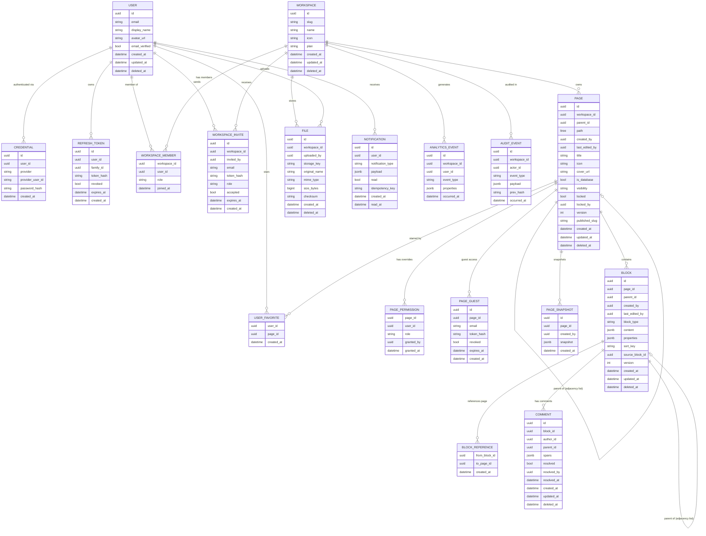

# BitTree — Data Model (PostgreSQL)

> **Database:** PostgreSQL 16
> **Query style:** `sqlx` with compile-time checked queries
> **Schema layout:** one Postgres instance; one schema per service

---

## Schema Layout

```
PostgreSQL instance: bittree
├── Schema: auth          (auth-service)
├── Schema: users         (user-service)
├── Schema: docs          (document-service, collaboration-service, template-service)
├── Schema: storage       (storage-service)
├── Schema: notifications (notification-service)
├── Schema: analytics     (analytics-service)
└── Schema: audit         (audit-service)
```

Cross-service references (e.g. `docs.blocks` referencing a user) store the UUID as a plain column — no cross-schema FK constraint. The application layer resolves the reference.

---

## Entity Relationship Diagram

> Solid lines = stored relationship (FK or adjacency list `parent_id`).
> Dashed lines = cross-schema reference (not DB-enforced; resolved at application layer).



---

## Schema Definitions

### `auth` Schema

```sql
CREATE TABLE auth.credentials (
    id          UUID PRIMARY KEY DEFAULT gen_random_uuid(),
    user_id     UUID NOT NULL,  -- references users.users(id), no FK (cross-schema)
    provider    VARCHAR NOT NULL CHECK (provider IN ('local', 'github', 'google')),
    provider_user_id VARCHAR,
    password_hash    VARCHAR,
    created_at  TIMESTAMPTZ NOT NULL DEFAULT NOW()
);

CREATE TABLE auth.refresh_tokens (
    id          UUID PRIMARY KEY DEFAULT gen_random_uuid(),
    user_id     UUID NOT NULL,
    family_id   UUID NOT NULL,
    token_hash  VARCHAR NOT NULL UNIQUE,
    revoked     BOOLEAN NOT NULL DEFAULT FALSE,
    expires_at  TIMESTAMPTZ NOT NULL,
    created_at  TIMESTAMPTZ NOT NULL DEFAULT NOW()
);
CREATE INDEX ON auth.refresh_tokens (token_hash);
```

### `users` Schema

```sql
CREATE TABLE users.users (
    id             UUID PRIMARY KEY DEFAULT gen_random_uuid(),
    email          VARCHAR NOT NULL UNIQUE,
    display_name   VARCHAR NOT NULL,
    avatar_url     VARCHAR,
    email_verified BOOLEAN NOT NULL DEFAULT FALSE,
    created_at     TIMESTAMPTZ NOT NULL DEFAULT NOW(),
    updated_at     TIMESTAMPTZ NOT NULL DEFAULT NOW(),
    deleted_at     TIMESTAMPTZ
);
CREATE INDEX ON users.users (email) WHERE deleted_at IS NULL;

CREATE TABLE users.workspaces (
    id         UUID PRIMARY KEY DEFAULT gen_random_uuid(),
    slug       VARCHAR NOT NULL UNIQUE,
    name       VARCHAR NOT NULL,
    icon       VARCHAR,
    plan       VARCHAR NOT NULL DEFAULT 'free'
                   CHECK (plan IN ('free', 'pro', 'team', 'enterprise')),
    created_at TIMESTAMPTZ NOT NULL DEFAULT NOW(),
    updated_at TIMESTAMPTZ NOT NULL DEFAULT NOW(),
    deleted_at TIMESTAMPTZ
);

-- Adjacency list: user membership in workspaces
CREATE TABLE users.workspace_members (
    workspace_id UUID NOT NULL REFERENCES users.workspaces(id),
    user_id      UUID NOT NULL,  -- references users.users(id)
    role         VARCHAR NOT NULL CHECK (role IN ('owner','admin','editor','commenter','viewer')),
    joined_at    TIMESTAMPTZ NOT NULL DEFAULT NOW(),
    PRIMARY KEY (workspace_id, user_id)
);

CREATE TABLE users.workspace_invites (
    id           UUID PRIMARY KEY DEFAULT gen_random_uuid(),
    workspace_id UUID NOT NULL REFERENCES users.workspaces(id),
    invited_by   UUID NOT NULL,
    email        VARCHAR NOT NULL,
    token_hash   VARCHAR NOT NULL UNIQUE,
    role         VARCHAR NOT NULL,
    accepted     BOOLEAN NOT NULL DEFAULT FALSE,
    expires_at   TIMESTAMPTZ NOT NULL,
    created_at   TIMESTAMPTZ NOT NULL DEFAULT NOW()
);

-- User favorites (adjacency list: user → page)
CREATE TABLE users.user_favorites (
    user_id    UUID NOT NULL,
    page_id    UUID NOT NULL,  -- cross-schema ref, no FK
    created_at TIMESTAMPTZ NOT NULL DEFAULT NOW(),
    PRIMARY KEY (user_id, page_id)
);
```

### `docs` Schema

```sql
CREATE EXTENSION IF NOT EXISTS ltree;

CREATE TABLE docs.pages (
    id              UUID PRIMARY KEY DEFAULT gen_random_uuid(),
    workspace_id    UUID NOT NULL,              -- cross-schema ref
    parent_id       UUID REFERENCES docs.pages(id),   -- adjacency list
    path            LTREE,                      -- e.g. 'root.abc123.def456'
    created_by      UUID NOT NULL,
    last_edited_by  UUID NOT NULL,
    title           VARCHAR NOT NULL,
    icon            VARCHAR,
    cover_url       VARCHAR,
    is_database     BOOLEAN NOT NULL DEFAULT FALSE,
    visibility      VARCHAR NOT NULL DEFAULT 'workspace'
                        CHECK (visibility IN ('private','workspace','custom','public')),
    locked          BOOLEAN NOT NULL DEFAULT FALSE,
    locked_by       UUID,
    version         INTEGER NOT NULL DEFAULT 0,
    published_slug  VARCHAR UNIQUE,
    created_at      TIMESTAMPTZ NOT NULL DEFAULT NOW(),
    updated_at      TIMESTAMPTZ NOT NULL DEFAULT NOW(),
    deleted_at      TIMESTAMPTZ
);
CREATE INDEX ON docs.pages USING GIST (path);
CREATE INDEX ON docs.pages (workspace_id, deleted_at);

CREATE TABLE docs.page_permissions (
    page_id    UUID NOT NULL REFERENCES docs.pages(id),
    user_id    UUID NOT NULL,
    role       VARCHAR NOT NULL CHECK (role IN ('editor','commenter','viewer')),
    granted_by UUID NOT NULL,
    granted_at TIMESTAMPTZ NOT NULL DEFAULT NOW(),
    PRIMARY KEY (page_id, user_id)
);

CREATE TABLE docs.page_guests (
    id         UUID PRIMARY KEY DEFAULT gen_random_uuid(),
    page_id    UUID NOT NULL REFERENCES docs.pages(id),
    email      VARCHAR NOT NULL,
    token_hash VARCHAR NOT NULL UNIQUE,
    revoked    BOOLEAN NOT NULL DEFAULT FALSE,
    expires_at TIMESTAMPTZ NOT NULL,
    created_at TIMESTAMPTZ NOT NULL DEFAULT NOW()
);

CREATE TABLE docs.blocks (
    id             UUID PRIMARY KEY DEFAULT gen_random_uuid(),
    page_id        UUID NOT NULL REFERENCES docs.pages(id),
    parent_id      UUID REFERENCES docs.blocks(id),   -- adjacency list: NULL = direct page child
    created_by     UUID NOT NULL,
    last_edited_by UUID NOT NULL,
    block_type     VARCHAR NOT NULL,
    content        JSONB NOT NULL DEFAULT '{}',
    properties     JSONB NOT NULL DEFAULT '{}',
    sort_key       VARCHAR NOT NULL,
    source_block_id UUID REFERENCES docs.blocks(id),  -- synced_block canonical ref
    version        INTEGER NOT NULL DEFAULT 0,
    created_at     TIMESTAMPTZ NOT NULL DEFAULT NOW(),
    updated_at     TIMESTAMPTZ NOT NULL DEFAULT NOW(),
    deleted_at     TIMESTAMPTZ
);
CREATE INDEX ON docs.blocks (page_id, sort_key) WHERE deleted_at IS NULL;
CREATE INDEX ON docs.blocks (parent_id) WHERE deleted_at IS NULL;

-- Adjacency list: backlinks (block references a page)
CREATE TABLE docs.block_references (
    from_block_id UUID NOT NULL REFERENCES docs.blocks(id) ON DELETE CASCADE,
    to_page_id    UUID NOT NULL,  -- cross-schema ref
    created_at    TIMESTAMPTZ NOT NULL DEFAULT NOW(),
    PRIMARY KEY (from_block_id, to_page_id)
);
CREATE INDEX ON docs.block_references (to_page_id);

CREATE TABLE docs.page_snapshots (
    id         UUID PRIMARY KEY DEFAULT gen_random_uuid(),
    page_id    UUID NOT NULL REFERENCES docs.pages(id),
    created_by UUID NOT NULL,
    snapshot   JSONB NOT NULL,
    created_at TIMESTAMPTZ NOT NULL DEFAULT NOW()
);
CREATE INDEX ON docs.page_snapshots (page_id, created_at);

CREATE TABLE docs.comments (
    id          UUID PRIMARY KEY DEFAULT gen_random_uuid(),
    block_id    UUID NOT NULL REFERENCES docs.blocks(id),
    author_id   UUID NOT NULL,
    parent_id   UUID REFERENCES docs.comments(id),  -- threaded replies
    spans       JSONB NOT NULL DEFAULT '[]',
    resolved    BOOLEAN NOT NULL DEFAULT FALSE,
    resolved_by UUID,
    resolved_at TIMESTAMPTZ,
    created_at  TIMESTAMPTZ NOT NULL DEFAULT NOW(),
    updated_at  TIMESTAMPTZ NOT NULL DEFAULT NOW(),
    deleted_at  TIMESTAMPTZ
);
```

### `storage` Schema

```sql
CREATE TABLE storage.files (
    id            UUID PRIMARY KEY DEFAULT gen_random_uuid(),
    workspace_id  UUID NOT NULL,
    uploaded_by   UUID NOT NULL,
    storage_key   VARCHAR NOT NULL,
    original_name VARCHAR NOT NULL,
    mime_type     VARCHAR NOT NULL,
    size_bytes    BIGINT NOT NULL,
    checksum      VARCHAR NOT NULL,
    created_at    TIMESTAMPTZ NOT NULL DEFAULT NOW(),
    deleted_at    TIMESTAMPTZ
);
CREATE INDEX ON storage.files (workspace_id, checksum);
```

### `notifications` Schema

```sql
CREATE TABLE notifications.notifications (
    id                UUID PRIMARY KEY DEFAULT gen_random_uuid(),
    user_id           UUID NOT NULL,
    notification_type VARCHAR NOT NULL
                          CHECK (notification_type IN ('page_shared','comment','invite','mention','page_updated')),
    payload           JSONB NOT NULL DEFAULT '{}',
    read              BOOLEAN NOT NULL DEFAULT FALSE,
    idempotency_key   VARCHAR NOT NULL UNIQUE,
    created_at        TIMESTAMPTZ NOT NULL DEFAULT NOW(),
    read_at           TIMESTAMPTZ
);
CREATE INDEX ON notifications.notifications (user_id, read, created_at DESC);
```

### `analytics` Schema

```sql
CREATE TABLE analytics.events (
    id           UUID PRIMARY KEY DEFAULT gen_random_uuid(),
    workspace_id UUID NOT NULL,
    user_id      UUID,
    event_type   VARCHAR NOT NULL,
    properties   JSONB NOT NULL DEFAULT '{}',
    occurred_at  TIMESTAMPTZ NOT NULL DEFAULT NOW()
);
-- Append-only: no UPDATE or DELETE permitted on this table
CREATE INDEX ON analytics.events (workspace_id, event_type, occurred_at);
```

### `audit` Schema

```sql
CREATE TABLE audit.events (
    id           UUID PRIMARY KEY DEFAULT gen_random_uuid(),
    workspace_id UUID NOT NULL,
    actor_id     UUID,  -- NULL = system action
    event_type   VARCHAR NOT NULL,
    payload      JSONB NOT NULL DEFAULT '{}',
    prev_hash    VARCHAR NOT NULL,  -- SHA-256 of previous event (hash chain)
    occurred_at  TIMESTAMPTZ NOT NULL DEFAULT NOW()
);
-- Append-only: no UPDATE or DELETE
CREATE INDEX ON audit.events (workspace_id, occurred_at);

-- Outbox pattern (in users schema, written alongside workspace changes)
CREATE TABLE users.webhook_outbox (
    id              UUID PRIMARY KEY DEFAULT gen_random_uuid(),
    workspace_id    UUID NOT NULL REFERENCES users.workspaces(id),
    event_type      VARCHAR NOT NULL,
    payload         JSONB NOT NULL DEFAULT '{}',
    status          VARCHAR NOT NULL DEFAULT 'pending'
                        CHECK (status IN ('pending','delivered','failed','dead')),
    attempts        INTEGER NOT NULL DEFAULT 0,
    next_attempt_at TIMESTAMPTZ NOT NULL DEFAULT NOW(),
    created_at      TIMESTAMPTZ NOT NULL DEFAULT NOW()
);
CREATE INDEX ON users.webhook_outbox (status, next_attempt_at) WHERE status = 'pending';
```

---

## Tree Traversal Queries

```sql
-- All top-level pages in a workspace (LTREE: direct children of root)
SELECT * FROM docs.pages
WHERE workspace_id = $1 AND parent_id IS NULL AND deleted_at IS NULL
ORDER BY path;

-- Full page subtree (LTREE: all descendants)
SELECT * FROM docs.pages
WHERE path <@ (SELECT path FROM docs.pages WHERE id = $1)
  AND deleted_at IS NULL;

-- All blocks in a page, ordered (adjacency list: direct page children)
SELECT * FROM docs.blocks
WHERE page_id = $1 AND parent_id IS NULL AND deleted_at IS NULL
ORDER BY sort_key;

-- Recursive block tree (full subtree of a block)
WITH RECURSIVE block_tree AS (
  SELECT *, 0 AS depth FROM docs.blocks
  WHERE page_id = $1 AND parent_id IS NULL AND deleted_at IS NULL
  UNION ALL
  SELECT b.*, bt.depth + 1 FROM docs.blocks b
  JOIN block_tree bt ON b.parent_id = bt.id
  WHERE b.deleted_at IS NULL
)
SELECT * FROM block_tree ORDER BY depth, sort_key;

-- All workspace members with roles
SELECT u.*, m.role, m.joined_at
FROM users.workspace_members m
JOIN users.users u ON u.id = m.user_id
WHERE m.workspace_id = $1;

-- All pages that link to a given page (backlinks)
SELECT DISTINCT b.page_id FROM docs.block_references br
JOIN docs.blocks b ON b.id = br.from_block_id
WHERE br.to_page_id = $1;

-- Pages a user can see (respects visibility + permission overrides)
SELECT p.* FROM docs.pages p
WHERE p.workspace_id = $1 AND p.deleted_at IS NULL
  AND (
    p.visibility = 'workspace'
    OR (p.visibility = 'private' AND p.created_by = $2)
    OR (p.visibility = 'custom' AND EXISTS (
      SELECT 1 FROM docs.page_permissions pp
      WHERE pp.page_id = p.id AND pp.user_id = $2
    ))
  );

-- User's starred pages
SELECT p.* FROM users.user_favorites f
JOIN docs.pages p ON p.id = f.page_id
WHERE f.user_id = $1 AND p.deleted_at IS NULL
ORDER BY f.created_at DESC;

-- Optimistic locking: conditional update
UPDATE docs.blocks
SET content = $1, version = version + 1, updated_at = NOW()
WHERE id = $2 AND version = $3;
-- 0 rows updated = version conflict → application returns 409
```

---

## Real-Time: LISTEN/NOTIFY

The collaboration-service subscribes to block changes within a page using PostgreSQL's `LISTEN/NOTIFY` for same-instance notifications, plus NATS JetStream for cross-instance fan-out:

```sql
-- Trigger: notify on block update
CREATE OR REPLACE FUNCTION docs.notify_block_change()
RETURNS TRIGGER AS $$
BEGIN
  PERFORM pg_notify(
    'block_updates_' || NEW.page_id::text,
    json_build_object('op', TG_OP, 'block_id', NEW.id, 'version', NEW.version)::text
  );
  RETURN NEW;
END;
$$ LANGUAGE plpgsql;

CREATE TRIGGER block_change_notify
AFTER INSERT OR UPDATE ON docs.blocks
FOR EACH ROW EXECUTE FUNCTION docs.notify_block_change();
```

```rust
// Rust (sqlx): listen for block changes on a page
let mut listener = PgListener::connect_with(&pool).await?;
listener.listen(&format!("block_updates_{}", page_id)).await?;
while let Ok(notification) = listener.recv().await {
    // process notification.payload()
}
```

---

## `block.content` JSONB Schema by Type

```json
// paragraph / heading_1–3 / quote / callout
{ "spans": [{ "text": "Hello", "bold": true, "color": "#FF5733" }] }

// callout (adds icon)
{ "icon": "💡", "spans": [...] }

// code
{ "code": "fn main() {}", "language": "rust" }

// image / file
{ "file_id": "uuid", "caption": "optional" }

// bookmark
{ "url": "https://...", "og_title": "...", "og_description": "...", "og_image": "..." }

// equation
{ "latex": "E = mc^2" }

// embed
{ "url": "https://...", "provider": "youtube", "embed_url": "...", "width": 640, "height": 360 }

// column_list  (no content — children are `column` blocks)
{}

// column
{ "width_ratio": 0.5 }  // fraction of total width; all siblings must sum to 1.0

// synced_block
{ "source_block_id": "uuid" }  // null if this IS the canonical source

// table_of_contents
{}  // no stored content — derived at read time by scanning heading blocks in page

// breadcrumb
{}  // no stored content — resolved at read time from page ancestor chain

// database (inline schema — is_database = true on the parent page)
{
  "properties": [
    { "id": "prop:uuid", "name": "Name",   "type": "title" },
    { "id": "prop:uuid", "name": "Status", "type": "select",
      "options": [{ "id": "opt:uuid", "name": "Todo", "color": "gray" }] },
    { "id": "prop:uuid", "name": "Due",    "type": "date" },
    { "id": "prop:uuid", "name": "Owner",  "type": "person" },
    { "id": "prop:uuid", "name": "Linked", "type": "relation",
      "target_database_id": "uuid", "sync_direction": "bidirectional" },
    { "id": "prop:uuid", "name": "Total",  "type": "rollup",
      "relation_property_id": "prop:uuid", "target_property_id": "prop:uuid",
      "aggregation": "sum" }
  ]
}

// database_row
{ "property_values": { "<prop_id>": "<typed_value>" } }
```

---

## `block.sort_key` — Fractional Indexing

Blocks use a lexicographically sortable string key (e.g., `"a0"`, `"a1"`, `"a0V"`) stored in the `sort_key` column. Inserting between two items generates a midpoint key with no renumbering.

When sort keys grow too long (pathological insert patterns), the rebalancer uses **interval DP** to find the minimum set of re-keys. See Phase 3 in `FEATURE_LIST.md`.

Reference: [Figma's fractional indexing post](https://www.figma.com/blog/realtime-editing-of-ordered-sequences/)

---

## Rust Type Mapping

```
PostgreSQL Table         ↔  Rust Struct (sqlx::FromRow, libs/shared)
──────────────────────────────────────────────────────────────────────
users.users              ↔  User       { id: UserId, email: String, ... }
users.workspaces         ↔  Workspace  { id: WorkspaceId, slug: String, ... }
docs.pages               ↔  Page       { id: PageId, visibility: Visibility, version: i32, ... }
docs.blocks              ↔  Block      { id: BlockId, block_type: BlockType, content: Json<BlockContent>, ... }
users.workspace_members  ↔  Member     { role: WorkspaceRole, joined_at: DateTime<Utc> }
docs.block_references    ↔  BlockRef   { from_block_id: BlockId, to_page_id: PageId, ... }
notifications.notifications ↔ Notification { id: NotifId, notification_type: NotifType, ... }
```

All ID types are newtypes over `Uuid` in `libs/shared`. Cross-schema references that cannot use FK constraints are stored as `Uuid` and validated at the application layer.
